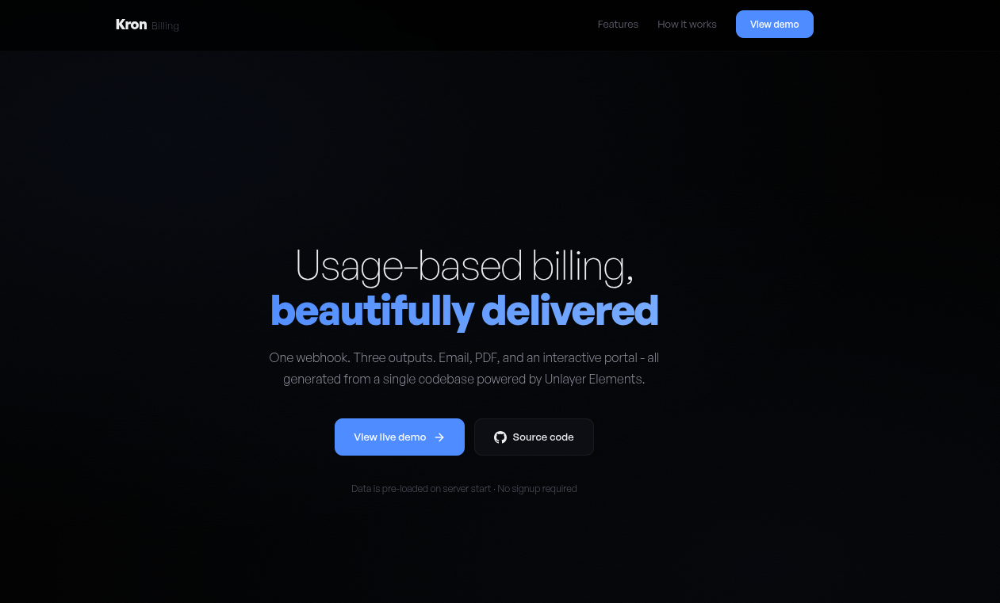
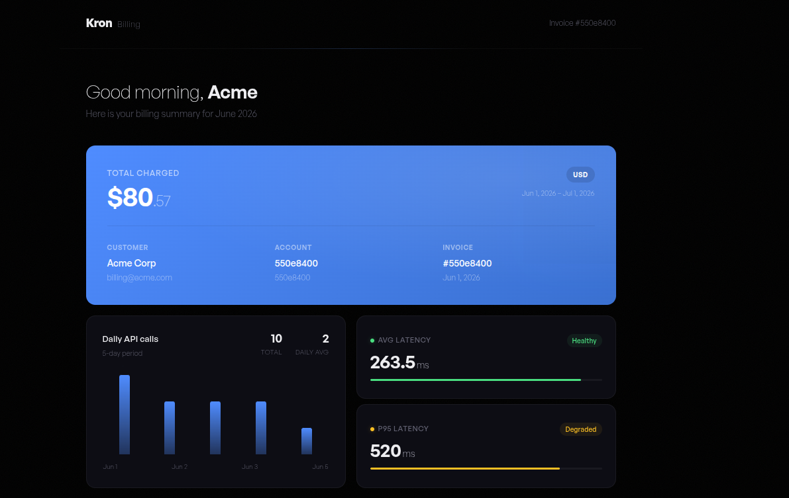
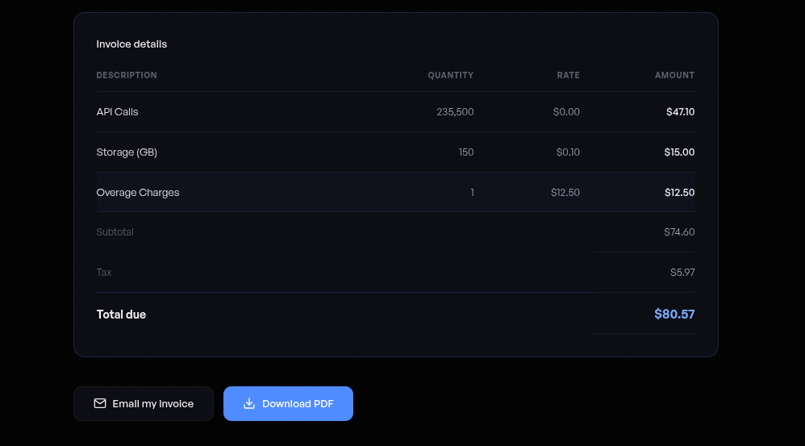
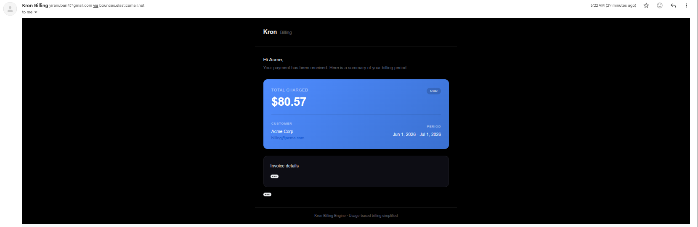

# Kron

A usage-based billing engine that turns a single webhook event into three customer-ready outputs: an interactive portal, a formatted email receipt, and a printable PDF invoice. Built with React, Express, and Unlayer Elements.

---

## Demo

The project is live at [https://kron-three.vercel.app](https://kron-three.vercel.app) with the backend on [https://kron-production-2936.up.railway.app](https://kron-production-2936.up.railway.app). Demo data is seeded automatically on startup, so no signup or API key is needed. To run the project locally, see the [Getting Started](#getting-started) section.

- **Portal**: [https://kron-three.vercel.app/portal/550e8400-e29b-41d4-a716-446655440001](https://kron-three.vercel.app/portal/550e8400-e29b-41d4-a716-446655440001)
- **PDF**: [https://kron-three.vercel.app/invoice/550e8400-e29b-41d4-a716-446655440001/pdf](https://kron-three.vercel.app/invoice/550e8400-e29b-41d4-a716-446655440001/pdf)
- **Email preview**: [https://kron-three.vercel.app/email/550e8400-e29b-41d4-a716-446655440001/preview](https://kron-three.vercel.app/email/550e8400-e29b-41d4-a716-446655440001/preview)

---

## Screenshots



The landing page promoting Kron's capabilities with a call to action to view the live demo.

 

The billing portal showing the invoice summary, usage chart, latency breakdown, and line item table.



The transactional email receipt with invoice summary, line items, and totals.

---

## Features

- **Interactive billing portal** -- A React SPA where customers can see their invoice summary, usage chart, latency stats, and line items. They can download the PDF or email the invoice to any address.
- **Formatted email receipts** -- Transactional emails with the invoice summary and a link to the full portal. Designed to render well in all major email clients.
- **Print-ready PDF invoices** -- Two-page PDF documents with an invoice on page one and an activity appendix (daily API calls chart, call records table) on page two. Generated via Puppeteer.
- **Usage aggregation** -- Incoming call records are grouped by date, and latency metrics (average, p95) are calculated automatically.
- **Webhook-driven workflow** -- A single POST with the invoice payload triggers everything: aggregation, rendering, and delivery.
- **Unlayer Elements powered** -- Email and PDF rendering shares React components from the Unlayer Elements library, ensuring visual consistency across formats.
- **Demo data pre-loaded** -- The server seeds itself with realistic invoice data on startup. The entire flow can be tested without setting up a billing provider.
- **Simulation script included** -- A Node.js script generates realistic usage data and sends it to the webhook endpoint for testing.

---

## Architecture

Kron follows a straightforward pipeline:

```
Webhook POST /webhook/invoice
        |
        v
  InvoiceService.processInvoice()
        |
        +--> UsageAggregationService groups records by date
        |    and calculates latency stats
        |
        +--> EmailRenderService produces HTML + plain text
        |
        +--> PdfRenderService produces a PDF via Puppeteer
        |
        +--> EmailService sends the receipt via the Elastic Email API
        |
        v
  Stored in memory (InvoiceRepository)
        |
        v
  Portal API serves interactive dashboard, PDF download,
  and email-on-demand from stored data
```

Both the email and PDF are rendered from the same data structure, using the same React component patterns through Unlayer Elements. This keeps the visuals consistent across formats.

---

## Tech Stack

| Layer | Technology |
| :--- | :--- |
| Server runtime | Node.js, TypeScript, Express |
| Frontend | React 19, TypeScript, Vite |
| Email rendering | Unlayer Elements (`@unlayer/react-elements`) |
| PDF generation | Puppeteer (headless Chrome) |
| Email delivery | Elastic Email API (v4 HTTP) |
| Data validation | Zod |
| Testing | Vitest, Supertest |
| In-memory store | Custom `MemoryStore` class |

---

## Getting Started

### Prerequisites

- Node.js 20.19 or later
- npm

### Installation

Clone the repository and install dependencies for both the server and the web frontend:

```bash
git clone https://github.com/Yiranubari/Kron.git
cd Kron

# Install server dependencies
cd server
npm install

# Install web frontend dependencies
cd ../web
npm install
```

### Configuration

Copy the environment example file and fill in the values:

```bash
cd server
cp .env.example .env
```

The environment file expects these variables:

| Variable | Description | Default |
| :--- | :--- | :--- |
| `PORT` | Server port | `3001` |
| `FRONTEND_URL` | URL of the web frontend | `http://localhost:5173` |
| `NODE_ENV` | Environment (`development`, `production`, `test`) | `development` |
| `SMTP_HOST` | SMTP server hostname (legacy, unused by the HTTP API) | `smtp.elasticemail.com` |
| `SMTP_PORT` | SMTP server port (legacy, unused by the HTTP API) | `2525` |
| `SMTP_ENCRYPTION` | Encryption method (legacy, unused by the HTTP API) | `starttls` |
| `SMTP_USER` | SMTP username (legacy, unused by the HTTP API) | --- |
| `SMTP_PASS` | Elastic Email API key (required for email sending) | --- |
| `FROM_EMAIL` | Sender email address | `billing@kron.dev` |
| `FROM_NAME` | Sender display name | `Kron Billing` |

The server does not crash if email sending is not configured. It will log a warning and continue, and the portal, PDF download, and email preview can still be tested locally. The simulation script generates realistic data without needing a real billing provider.

### Running the Project

Start the server and the web frontend in separate terminals:

**Terminal 1 -- Server**:

```bash
cd server
npm run dev
```

The server starts on `http://localhost:3001`. Demo data is seeded automatically.

**Terminal 2 -- Web frontend**:

```bash
cd web
npm run dev
```

The frontend starts on `http://localhost:5173`. Vite proxies `/api`, `/invoice`, and `/email` requests to the server.

### Using the Simulation Script

To test with different data or trigger a fresh invoice:

```bash
node scripts/simulate-webhook.mjs
```

This sends a realistic invoice payload to `http://localhost:3001/webhook/invoice`. Pass a different server URL and customer email as optional arguments:

```bash
node scripts/simulate-webhook.mjs http://localhost:3001 customer@example.com
```

---

## API Reference

### POST /webhook/invoice

Process an incoming invoice payload. This is the main entry point for the billing pipeline.

**Request body** (JSON):

```json
{
  "customer": {
    "name": "Acme Corp",
    "email": "billing@acme.com",
    "accountId": "550e8400-e29b-41d4-a716-446655440000"
  },
  "invoice": {
    "id": "550e8400-e29b-41d4-a716-446655440001",
    "period": {
      "start": "2026-06-01T00:00:00.000Z",
      "end": "2026-07-01T00:00:00.000Z"
    },
    "currency": "USD",
    "lineItems": [
      { "description": "API Calls", "quantity": 235500, "rate": 0.0002, "amount": 47.10 },
      { "description": "Storage (GB)", "quantity": 150, "rate": 0.10, "amount": 15.00 },
      { "description": "Overage Charges", "quantity": 1, "rate": 12.50, "amount": 12.50 }
    ],
    "subtotal": 74.60,
    "tax": 5.97,
    "total": 80.57
  },
  "usage": {
    "dailyCallCounts": [
      { "date": "2026-06-01", "count": 8500 },
      { "date": "2026-06-02", "count": 9200 }
    ],
    "latency": {
      "average": 245,
      "p95": 610
    },
    "callRecords": [
      {
        "timestamp": "2026-06-01T08:23:15.000Z",
        "endpoint": "https://api.acme.com/v1/orders",
        "responseTimeMs": 210
      }
    ]
  }
}
```

**Response**:

```json
{
  "invoiceId": "550e8400-e29b-41d4-a716-446655440001",
  "portalUrl": "https://kron-three.vercel.app/portal/550e8400-e29b-41d4-a716-446655440001",
  "pdfUrl": "/invoice/550e8400-e29b-41d4-a716-446655440001/pdf"
}
```

### GET /api/portal-data/:invoiceId

Returns the stored portal data for an invoice (customer info, invoice details, usage stats).

### GET /invoice/:invoiceId/pdf

Downloads the invoice as a PDF file.

### GET /email/:invoiceId/preview

Renders the email HTML in the browser for preview purposes.

### POST /invoice/:invoiceId/send

Sends the invoice email to a specified address.

**Request body**:

```json
{
  "email": "customer@example.com"
}
```

### GET /health

Returns `{ "status": "ok" }` for health checks.

---

## Project Structure

```
Kron/
├── server/                        # Express backend
│   ├── src/
│   │   ├── config/                # Environment config (Zod schema)
│   │   │   ├── index.ts
│   │   │   └── env.ts
│   │   ├── constants/             # Error codes, HTTP status codes
│   │   │   ├── error-codes.ts
│   │   │   └── status.ts
│   │   ├── exceptions/            # Custom error classes
│   │   │   └── app-exceptions.ts
│   │   ├── infrastructure/        # Services (email, PDF, logging, store)
│   │   │   ├── email.service.ts
│   │   │   ├── logger.service.ts
│   │   │   ├── memory-store.service.ts
│   │   │   └── pdf-converter.service.ts
│   │   ├── middleware/            # Express middleware
│   │   │   ├── error-handler.ts
│   │   │   ├── logger.ts
│   │   │   └── validator.ts
│   │   ├── modules/
│   │   │   ├── invoice/           # Invoice domain (routes, controllers, service, repository, schema)
│   │   │   ├── rendering/         # Email and PDF rendering (Unlayer Elements components)
│   │   │   └── usage/             # Usage aggregation
│   │   ├── types/                 # Repository and store interfaces
│   │   ├── utils/                 # Number and date formatters
│   │   ├── app.ts                 # Express app factory
│   │   └── index.ts               # Entry point (seeds demo data)
│   ├── tests/                     # Vitest test files
│   ├── tsconfig.json
│   └── package.json
│
├── web/                           # React frontend
│   ├── src/
│   │   ├── api/                   # API client types and fetchers
│   │   │   └── client.ts
│   │   ├── components/            # Reusable UI components
│   │   │   ├── SummaryCard.tsx    # Invoice summary with total amount
│   │   │   ├── UsageChart.tsx     # Bar chart of daily API calls
│   │   │   ├── LineItemTable.tsx  # Line items with subtotal/tax/total
│   │   │   ├── LatencyStats.tsx   # Average and p95 latency display
│   │   │   └── Toast.tsx          # Notification toasts
│   │   ├── hooks/                 # Custom React hooks
│   │   │   ├── useInvoiceData.ts  # Fetch and manage invoice data state
│   │   │   └── useToast.ts        # Toast notification state
│   │   ├── pages/                 # Page components
│   │   │   ├── LandingPage.tsx    # Marketing/landing page
│   │   │   └── PortalPage.tsx     # Billing portal dashboard
│   │   ├── App.tsx                # Route configuration
│   │   ├── index.css              # Global styles and design tokens
│   │   └── main.tsx               # Entry point with BrowserRouter
│   ├── index.html
│   ├── vite.config.ts
│   ├── tsconfig.json
│   └── package.json
│
├── scripts/
│   └── simulate-webhook.mjs       # Generates and sends test webhook payloads
├── docker-compose.yml
├── .env.example
└── README.md
```

---

## Scripts

### Server

| Command | Description |
| :--- | :--- |
| `npm run dev` | Start the server in development mode with hot reload |
| `npm run build` | Compile TypeScript to JavaScript |
| `npm start` | Run the compiled server from the dist directory |
| `npm test` | Run tests in watch mode |
| `npm run test:run` | Run tests once and exit |

### Web Frontend

| Command | Description |
| :--- | :--- |
| `npm run dev` | Start the Vite dev server with hot module replacement |
| `npm run build` | Build for production |
| `npm run preview` | Preview the production build locally |

### Simulation

| Command | Description |
| :--- | :--- |
| `node scripts/simulate-webhook.mjs` | Send a test invoice payload to the webhook endpoint |

---

## Testing

Tests are written with Vitest and are located in the `server/tests/` directory.

Run the test suite:

```bash
cd server
npm run test:run
```

The test suite covers:

- **Invoice service** -- Processing webhook payloads, retrieving portal data, sending emails, generating PDFs
- **Usage aggregation** -- Grouping call records by date, calculating average and p95 latency
- **Invoice repository** -- CRUD operations for stored invoices
- **Email service** -- Elastic Email API payload shape and error handling
- **Webhook e2e** -- Full integration test of the webhook endpoint

---

## Design Decisions

**In-memory storage**: Kron uses an in-memory store by design. This keeps the project simple to set up and run without needing any external services (databases, Redis, etc.). Data is lost when the server stops, which is fine for demos and development. For production use, the `InvoiceRepository` and `MemoryStore` can be swapped out for a database-backed implementation that implements the same `IRepository` interface.

**Unlayer Elements for both email and PDF**: The same React component structure is used for both email and PDF rendering. For emails, Elements provides the `Email` and `Html` components that wrap templates with email-client-safe markup. For PDFs, raw HTML is passed directly to Puppeteer to avoid layout quirks from the Elements `Document` component. This means design patterns can be shared across formats while still getting the best rendering engine for each output.

**No external dependencies for demo**: The server comes with built-in demo data that seeds on startup. The landing page and portal work without any configuration. Only an Elastic Email API key is needed to actually send emails.

---

## Acknowledgements

This project was built with [Unlayer Elements](https://unlayer.com), and it is part of the Build with Elements Challenge. The Elements library handles the heavy lifting for email-friendly HTML rendering.

---

## Deployment

Kron uses a two-service architecture: the Express backend (with Puppeteer) runs on Railway, and the React frontend runs on Vercel. Deploy in this order: **Railway first, then Vercel**, because the frontend needs your Railway URL.

### Server: Railway

The server deploys with a **Dockerfile** (`server/Dockerfile`), not Nixpacks. This is required because Nixpacks installs Chromium from Ubuntu 24.04's apt repository, where the `chromium` package is a snap transitional stub that cannot run inside a container. The Dockerfile uses a Debian-based Node image, installs Chrome for Testing via Puppeteer's own installer, and keeps the `--no-sandbox` launch flags that root containers need.

**Steps:**

1. Push the repository to GitHub.
2. Go to [railway.app](https://railway.app) and create a new project.
3. Select **Deploy from GitHub repo** and connect your repository.
4. Set the **Root Directory** to `server` (the included `server/railway.json` pins the Dockerfile builder, health check, and restart policy).
5. Railway builds the image and runs the container. The health check at `GET /health` is used for deployment status.
6. Set these environment variables in the Railway dashboard (Variables tab):

| Variable | Description |
| :--- | :--- |
| `FRONTEND_URL` | Your Vercel deployment URL (e.g. `https://kron-three.vercel.app`) |
| `SMTP_PASS` | Your Elastic Email API key (required for email sending) |
| `SMTP_HOST` | SMTP server hostname (legacy, unused by the HTTP API) |
| `SMTP_PORT` | SMTP server port (legacy, unused by the HTTP API) |
| `SMTP_ENCRYPTION` | Encryption method (legacy, unused by the HTTP API) |
| `SMTP_USER` | SMTP username (legacy, unused by the HTTP API) |
| `FROM_EMAIL` | Sender email address |
| `FROM_NAME` | Sender display name |

7. Once deployed, copy your Railway URL (e.g. `https://kron-production-2936.up.railway.app`).

**Verify the server:**

```bash
curl https://kron-production-2936.up.railway.app/health
# -> {"status":"ok"}
```

> Email sending is optional. If `SMTP_PASS` (the Elastic Email API key) is left unset, the server boots fine, email sending returns a friendly error, and the portal, PDF, and email preview endpoints still work.

> Chrome for Testing is installed during the Docker build into Puppeteer's cache, so `PUPPETEER_SKIP_DOWNLOAD` and `PUPPETEER_EXECUTABLE_PATH` are **not** needed. Do not set them; they would point at a browser that does not exist in this image.

> The Dockerfile pins `npm@11.6.1` (`npm install -g npm@11.6.1`) on purpose: the committed lockfile is generated by npm 11, and the base image's stock npm 10 rejects it with an EUSAGE error about missing `@emnapi/*` entries. Do not remove or change this pin unless you also regenerate the lockfile with a matching npm version.

> Building the Docker image locally for testing requires Docker. Run `docker build -t kron-server .` inside `server/`.

### Frontend: Vercel

[Vercel](https://vercel.com) hosts the React SPA and proxies API calls to Railway.

**Steps:**

1. Go to [vercel.com](https://vercel.com) and create a new project.
2. Import your GitHub repository.
3. Set the **Root Directory** to `web`.
4. Set the **Build Command** to `npm run build`.
5. Set the **Output Directory** to `dist`.
6. Open `web/vercel.json` and replace `RAILWAY_URL` with your Railway deployment domain (e.g. `kron-production-2936.up.railway.app`):

   ```json
   {
     "rewrites": [
       {
         "source": "/api/(.*)",
         "destination": "https://kron-production-2936.up.railway.app/api/$1"
       },
       {
         "source": "/invoice/(.*)",
         "destination": "https://kron-production-2936.up.railway.app/invoice/$1"
       },
       {
         "source": "/email/(.*)",
         "destination": "https://kron-production-2936.up.railway.app/email/$1"
       },
       {
         "source": "/(.*)",
         "destination": "/index.html"
       }
     ]
   }
   ```

7. Commit and push the change. Vercel deploys automatically on push.
8. Open your deployment settings and set `FRONTEND_URL` on Railway to your Vercel URL if you did not set it already, so webhook responses return working portal links.

**Verify the full stack:**

1. The frontend is live at `https://kron-three.vercel.app`.
2. The demo invoice is seeded automatically when the Railway server starts, so open `https://kron-three.vercel.app/portal/550e8400-e29b-41d4-a716-446655440001` to see the portal with data.
3. API calls from the browser hit Vercel, which forwards them to Railway seamlessly.
4. Test the webhook end to end by POSTing the payload from the API reference above to `https://kron-production-2936.up.railway.app/webhook/invoice` (or run `node scripts/simulate-webhook.mjs https://kron-production-2936.up.railway.app`).

---

## License

MIT
